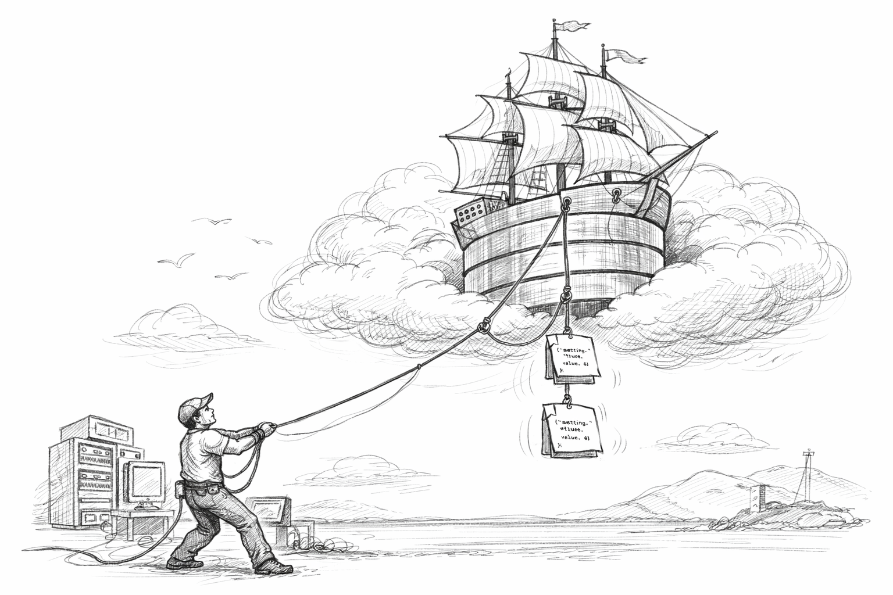

# Hoist has moved. Welcome to Rigg

> Hoist has been renamed to **Rigg**. Same product direction, sharper identity, and all future updates in one place.

---

## What changed?

**Hoist is now Rigg.**

This repository remains here as a signpost, but active development, fixes, documentation, and new features now live in the Rigg repository.

## What stays the same?

- The core idea and functionality you used in Hoist
- The project team behind it
- The path forward for ongoing improvements

## Why move now?

Rigg gives the project a clearer name and a better home for everything coming next.

If you were looking for Hoist, you are in the right place. You just need to continue to Rigg.

## Go to Rigg

**[Continue to the Rigg repository](https://github.com/mklab-se/rigg)**

---

Thanks for following Hoist. The next chapter is happening at **Rigg**.
